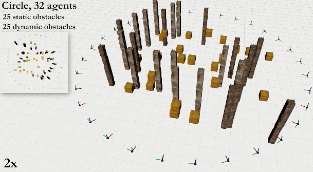

# MADER: Trajectory Planner in Multi-Agent and Dynamic Environments #

# Code at: [https://github.com/mit-acl/mader/](https://github.com/mit-acl/mader/)

The code for [MADER: Trajectory Planner in Multi-Agent and Dynamic Environments](https://arxiv.org/abs/2010.11061) ([pdf](https://arxiv.org/abs/2010.11061), [video](https://www.youtube.com/watch?v=aoSoiZDfxGE)) has been released at [https://github.com/mit-acl/mader/](https://github.com/mit-acl/mader/)

Single-Agent               |  Multi-Agent           | 
:-------------------------:|:-------------------------:|
      |   |  
       |      |  